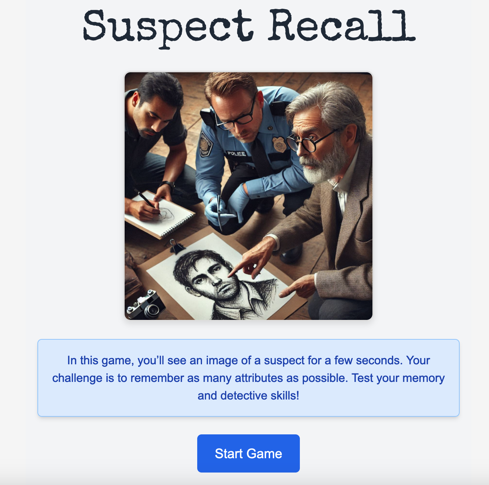
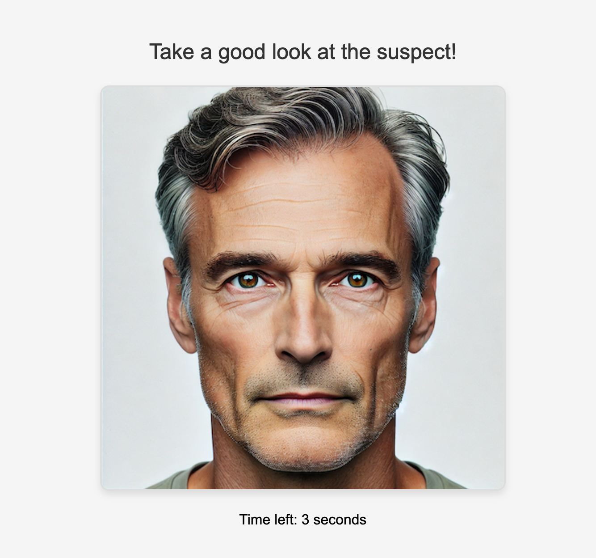
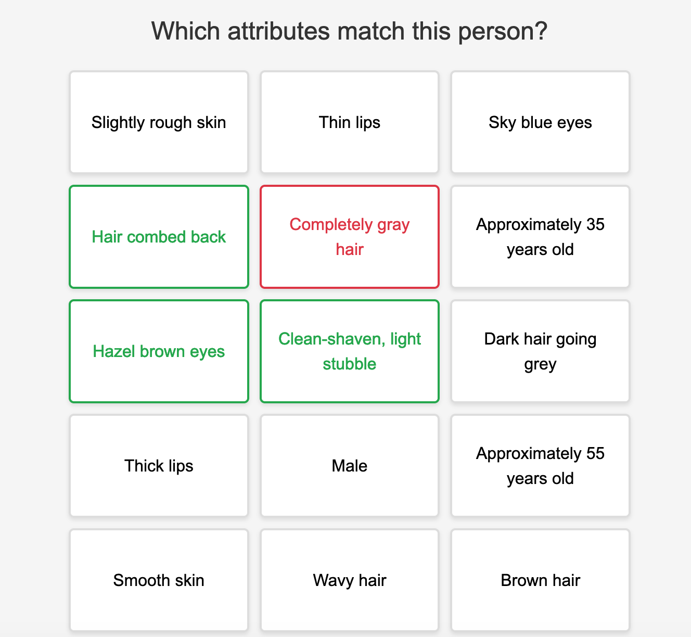

# Suspect Recall
A game for testing your memory and detective skills!

<p align="center">
  
  
  
</p>

## Build

```
cd frontend
npm install
npm run build
```

## Run locally 

```
add `REACT_APP_MODE=development` to .env file
cd frontend
npm run start

(another terminal window)
cd ..
go run .
go to http://localhost:3000

(you can install air https://github.com/air-verse/air for live-reload)
```

## Deploy to Google App Engine

```
gcloud app deploy
```

## Tests

```
go test ./...
```